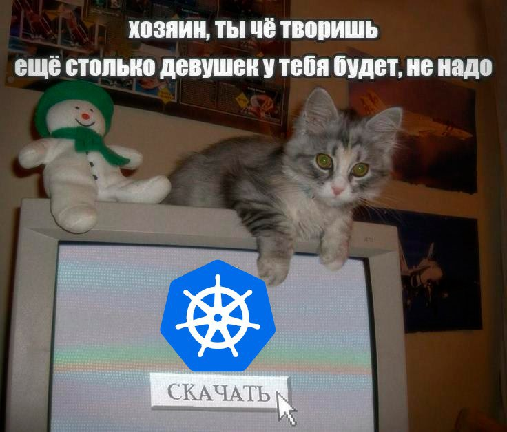

```
███╗   ███╗██╗  ██╗ █████╗ ██████╗ ██████╗  
████╗ ████║██║ ██╔╝██╔══██╗██╔══██╗██╔══██╗
██╔████╔██║█████╔╝ ███████║██║  ██║██║  ██║
██║╚██╔╝██║██╔═██╗ ██╔══██║██║  ██║██║  ██║
██║ ╚═╝ ██║██║  ██╗██║  ██║██████╔╝██████╔╝
╚═╝     ╚═╝╚═╝  ╚═╝╚═╝  ╚═╝╚═════╝ ╚═════╝ 
```
**MKADD** - это аббревиату́ра от *Миша*, *Костя*, *Алёна*, *Даня*, *Дима*. Альтернативным вариантом был **Paint 2**.
# Что делает это приложение? 
## <Тут GIF не забыть вставить> 

# Требования к выполнению работы  
- Для хранения кода используется Git (GitHub)
- Наличиствует два сервиса (backend и frontend)
- Используется PostgreSQL
- Для контейнеризации используется Docker
- CI/CD-конфигурация представлена в `.github/workflows/`
- Kubernetes забыт
- Про Helm charts и Terraform тут тоже не слышали
- Секреты хранятся посредством GitHub Secrets

# Этапы выполнения работы
## 1. Описание репозитория  
- Проект состоит из двух сервисов: бэкенда на Go и фронтенда на Flutter.
- Репозиторий имеет следующую структуру:
```
├── assets/          # тут я картинки для README.md храню
├── back/            # бэк (на Go)
│   ├── cmd/app/     # точка входа приложения
│   ├── internal/    # архитектура (по-хорошему нужно у Алены с Костей спросить):
│   │   ├── domain/  # сущности и логика
│   │   ├── app/     # use cases и сервисы
│   │   └── adapters/# http-хендлеры, репозитории, интеграции и прочее 
│   ├── pkg/         # переиспользуемые компоненты (ошибки, swagger, websocket)
│   ├── swagger/     # автогенерируемая OpenAPI-документация
│   └── ...          # Dockerfile, docker-compose, тесты
├── front/           # фронт (тут Flutter)
│   ├── lib/
│   │   ├── core/    # базовые компоненты (API-клиент, темизация)
│   │   ├── features/# фичи по модулям (лучше у Миши с Димой спросить):
│   │   │   ├── registration/ # аутентификация
│   │   │   └── whiteboard/   # интерактивная доска с инструментами рисования
│   │   └── ...      # сервисы, виджеты
│   └── ...          # конфиги для разных платформ, Dockerfile
├── .github/         # ci/cd непосредственно
└── README.md        # данная документация
```
- Вся база данных PostgreSQL описана в `./internal/adapters/repositories/*.go`. Мне очень не хочется здесь рисовать её схему, спасибо за понимание.

## 2. CI: сборка и проверка  
- Ни линтеров, ни unit-тестов не вставляли  
- Интеграционные тесты тоже не запускаем
- Про security scan (SAST, SCA) я даже не слышал, если честно  
- Docker-образы собираются и загружаются в реестр GitHub
- Запрещать пуш при критических уязвимостях мне представляется высшим пилотажем, поэтому я этого не добавял  

## 3. CD: развёртывание в Kubernetes  


Всё работает на Docker Compose и с божьей помощью.

- Никаких helm-чартов для сервисов
- Никакой стратегии canary или blue-green
- Readiness/Liveness probes не настроены
- Автоматического rollback при ошибках не происходит
- Миграций БД нет  

## 4. Наблюдаемость и тестирование  
Мемов про Prometheus и Grafana у меня, к сожалению, нет
# Дополнительно


Если хотите увидеть процесс сборки и пуша, откройте Issue, я получу письмо и запущу процесс вручную на локальном сервере

# Авторы: 
- [Alena Kharlova](https://github.com/Khrllw) (главная по бэку)
- [Danila Danenko](https://github.com/ekkimukk) (DevSecFinAIOps данного проекта)
- [Dmitry Lutsenko](https://github.com/LendorD) (фронтенд)
- [Mikhail Tumin](https://github.com/Tummix) (генеральный директор)
- [Konstantin Khaidarshin](https://github.com/MENGERSPONGEKNGLTYN) (просто лучший друг гендира)
